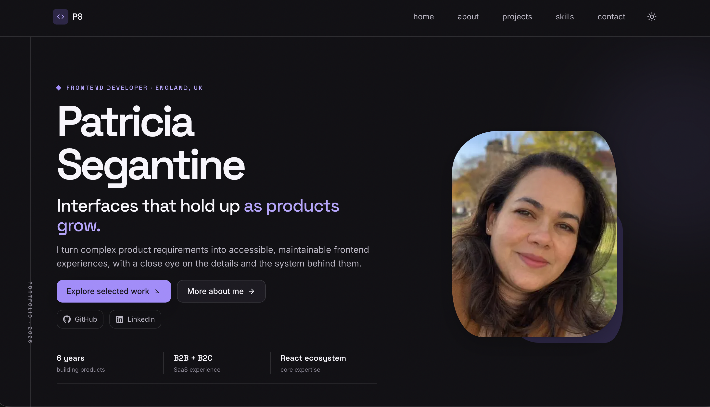

# Patricia Segantine | Portfolio

A personal space where I share selected projects, ideas, and my journey in frontend development.

---



## 📖 Overview

This portfolio presents my work as a Senior Frontend Developer through selected projects, practical case studies, and the technologies I use to build modern web experiences.

It highlights both the final interface and the thinking behind each solution, including performance, accessibility, maintainable code structure, and user-centred product decisions.

---

## 🔗 Live Preview

[https://patriciasegantine.vercel.app](https://patriciasegantine.vercel.app/)

## ✨ Tech Stack

- Next.js
- React
- TypeScript
- Tailwind CSS
- PostCSS
- ESLint

## 🎯 Highlights

- Responsive layout across devices
- Subtle animations and reveal-on-scroll effects
- Strongly typed codebase with TypeScript
- System-aware light/dark theme with smooth transitions
- Loading feedback for route and project-details navigation
- SEO-aware structure and fast performance
- Scalable component architecture

## 📦 Prerequisites

- Node.js `18.17+`
- npm (or yarn/pnpm)

## ⚙️ Installation

```bash
git clone https://github.com/patriciasegantine/portfolio.git
cd portfolio
npm install
```

## 🚀 Available Scripts

```bash
npm run dev     # development environment
npm run build   # production build
npm run start   # run production server
npm run lint    # static analysis
npm run test    # run automated tests
npm run pre-pr  # lint + tests + production build
```

## 🌐 Deploy

Recommended deployment on [Vercel](https://vercel.com/) with direct Git integration.

## 👩‍💻 Author

Created by **Patricia Segantine**, Senior Frontend Developer  
[LinkedIn](https://linkedin.com/in/patriciasegantine) · [Portfolio](https://patriciasegantine.vercel.app/)
